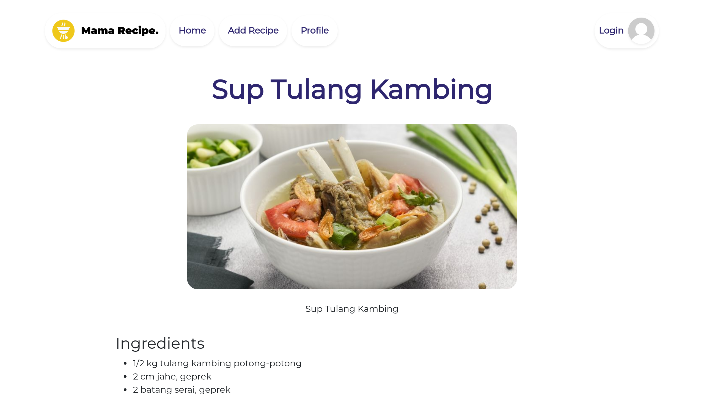

# Mama Recipe x Orenji -  Backend

  
This is a repository for Mama Recipe and Tomato, both are same application while Tomato is a fork from Mama Recipe Project. This Project is about a recipe applicaion that has a service like adding,save,favorite,like recipe, and other.

Developer :

> 

Check this link to view the Mama Recipe Web : <https://recipes-web-fe.vercel.app/>

## How to run  

On Local :

1. Clone this repository ``https://github.com/Team-A-Pijarcamp-Batch-15/receipes-web-be``
2. Install the dependencies with command  ``npm install``  
3. Setup the [environment](#environment) variable bellow this section.
4. Run with command ``npm run start`` or for the next using ``npm run dev``

note that npm run start will also running the migration database, so please configure the environment properly.

## Environment

**Please read carefully this section.**  
Use environment name ``.env.local`` for local development.  
Fill related configuration below before running the app.

```bash

#
# ADD APP Environment Setting
# Fill NODE_ENV if you want to use cloud database in local
# this .env.local in the end is dosen't matter, because of
# on the production is using OS ENV.
#
# NODE_ENV = "production" or leave empty string
# APP_HOST = "" default is empty string
# PORT = "" default is 3000
#

NODE_ENV=
APP_HOST=
PORT=

#
# Fill with generated SHA1 hash for JWT Secret
#

APP_SECRET_TOKEN=

# ADD FE_URI for Spesific CORS Setting
FE_URI=

#
# The Idea to make different DB config is to make seamlesly switching between db config on local and development.
# If you want to use cloud database in local fill NODE_ENV with production or leave it empty.
#

# CONFIG DB PRODUCTION
DB_HOST=
DB_USER=
DB_PASS=
DB_NAME=
DB_PORT=

# CONFIG FOR LOCAL
DB_HOST_LOCAL=
DB_USER_LOCAL=
DB_PASS_LOCAL=
DB_NAME_LOCAL=
DB_PORT_LOCAL=

# CONFIG FOR CLOUDINARY (STORAGE CDN)
CLOUDINARY_CLOUD_NAME=
CLOUDINARY_API_KEY=
CLOUDINARY_API_SECRET=

# SMTP Service 
# This app using gmail as mail service provider
# need to modify the ./src/Utils/smtp.js if you want to change mail service provider
GOOGLE_EMAIL=
GOOGLE_APP_PASSWORD=

```

## Screenshoots

### Home

  

### Recipe Detail



### Recipe Login Register

Note that login register has same design.


