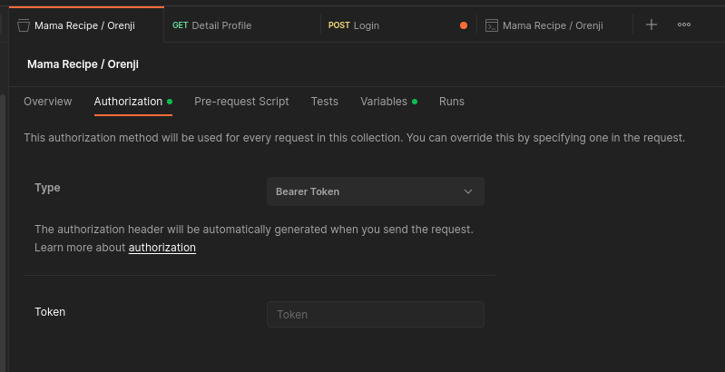
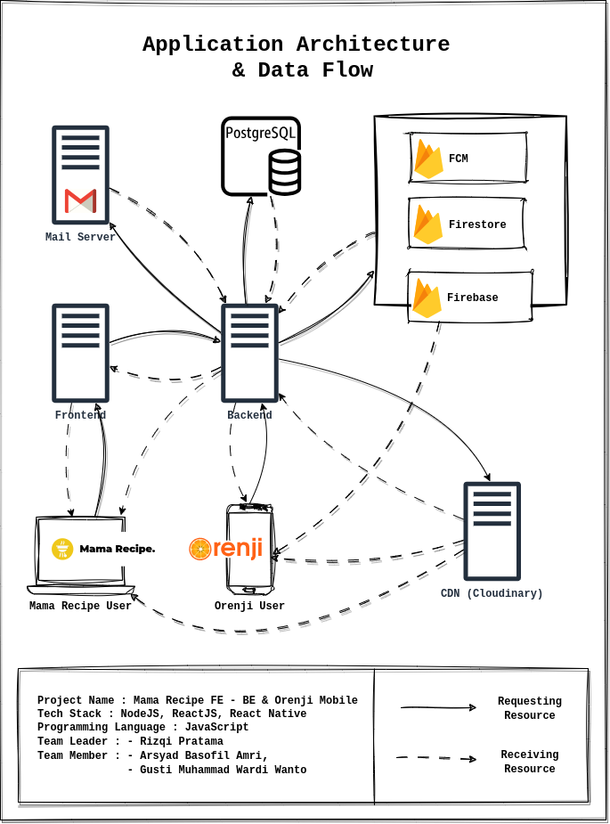

# Mama Recipe Web x Orenji Mobile - Backend

  

This is a repository for Mama Recipe and Orenji, both are same backend while Orenji is One of a Mobile version from Mama Recipe Project. This Project is about a recipe applicaion that has a service like adding,save,favorite,like recipe, and other.

Developer :

> 

Tech Stack : ExpressJS, Sequelize ORM, Postgres, FCM (Admin), Firestore (Admin), SMTP, Cloudinary".  
Backend URL : <https://mama-recipe-web-be.vercel.app>

## Table Of Content

- [Mama Recipe Web x Orenji Mobile - Backend](#mama-recipe-web-x-orenji-mobile---backend)
  - [Table Of Content](#table-of-content)
  - [Api Collection](#api-collection)
    - [Login Api](#login-api)
    - [Detail Profile Api](#detail-profile-api)
  - [How to run](#how-to-run)
    - [Run on local](#run-on-local)
    - [Run on production](#run-on-production)
  - [Architecture and Data Flow](#architecture-and-data-flow)

## Api Collection

[](https://god.gw.postman.com/run-collection/31887036-b7325b32-ede3-44ee-97f0-7167c422f018?action=collection%2Ffork&source=rip_markdown&collection-url=entityId%3D31887036-b7325b32-ede3-44ee-97f0-7167c422f018%26entityType%3Dcollection%26workspaceId%3Da3e74e79-7441-46b7-ab79-84fcc8a5c2a8)

To try our Api's please import the postman api collection on folder ``docs/PostmanCollection/`` or fork by button above.

> Some api's need a Bearer Token to access, you can add to the section bellow. you can acquire the token from login by using this collection.



### Login Api

> **This is an example how to use the Login Api.**  
> Make a ``POST`` Request to ``{{url}}/user/login`` with body json

```json
{
    "email": "real-email@example.com",
    "password": "good-password"
}
```

> If success you will acquire response

```json
{
    "status": 200,
    "message": "Login Success",
    "data": {
        "user_uid": "425153a3-27a1-4b17-a470-4dd2c0bf05f5",
        "first_name": "Birdie",
        "last_name": "McCullough",
        "photo_profile": "https://res.cloudinary.com/dwptyupfa/image/upload/v1702973222/profile/i0bxegbko7lmpiug0wfm.png"
    },
    "token": "HERE_IS_YOUR_TOKEN"
}
```

> After you getting the token, then put the token into Authorization.  
> And select the Bearer Token for the Auth Type.

### Detail Profile Api

> **Then let make a request to protected api**  
> Make a ``GET`` Request to ``{{url}}/user/profile``

> If you has a correctly set the Bearer Token it will return.

```json
{
    "status": 200,
    "message": "ok",
    "data": {
        "first_name": "Birdie",
        "last_name": "McCullough",
        "phone_number": "088800111000",
        "email": "real-email@example.com",
        "photo_profile": "https://res.cloudinary.com/dwptyupfa/image/upload/v1702973222/profile/i0bxegbko7lmpiug0wfm.png"
    }
}
```

> If Not

```json
{
    "status": 401,
    "message": "please not directy consume this message to the client, you're try to access the endpoint that need a login, or you has not correctly attach the auth headers."
}
```

## How to run  

### Run on local

To running this project localy please do step by step carefully if not this will not run or not running propperly. you may need ``.env.example`` file to guide setup the environment.

1. Clone this repository
   > ``git clone https://github.com/Team-A-Pijarcamp-Batch-15/receipes-web-be``
2. Install the dependencies.
   > ``npm install``

3. Setup Database.
   > **Important This Project is spesific configured to use PostgreSQL**  
   > then get the credential, after than put the credential to ``.env``  

4. Setup Firebase (For Firebase Cloud Messaging & Firestore).
   > then get the Admin SDK, after than put the credential to ``.env``  
   > I am not provide this because it's credential.

5. Setup SMTP service, for this you you can config the SMTP at ``src/Utils/smtp.js``
   > Then get the credential, and put into ``.env`` files.

6. Setup the Cloudinary (Storage CDN)
   > Then get the credential, and put into ``.env`` files.
7. Fill the rest of environment variable, an exampe configuration available at  root of this project named ``.env.exampe``.
8. Finally you can run this backend.
   > ``npm run start`` will do migration on every execution.  
   > Use ``npm run dev`` instead to run on local machine.

### Run on production

On production has a variety way to run the application, Every detail step is important and also you need some **knowledge base about your cloud provider, to run this app.** for this you can read the documentation that provided by your cloud provider.

## Architecture and Data Flow

> **Note : This is not an actual data flow, it just an overview from overall business logic. Beautiful Isn't it?**


